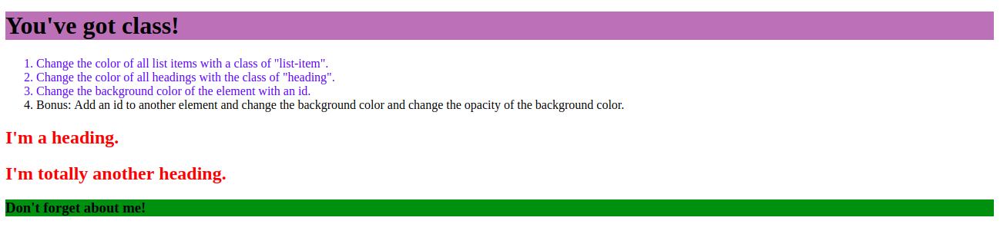

# You've got class!

**Instructions**:
*  Change the color of all list items with a class of "list-item".
* Change the color of all headings with the class of "heading".
* Change the background color of the element with an id.

**Bonus**: Add an id to another element and change the background color and change the opacity of the background color.

